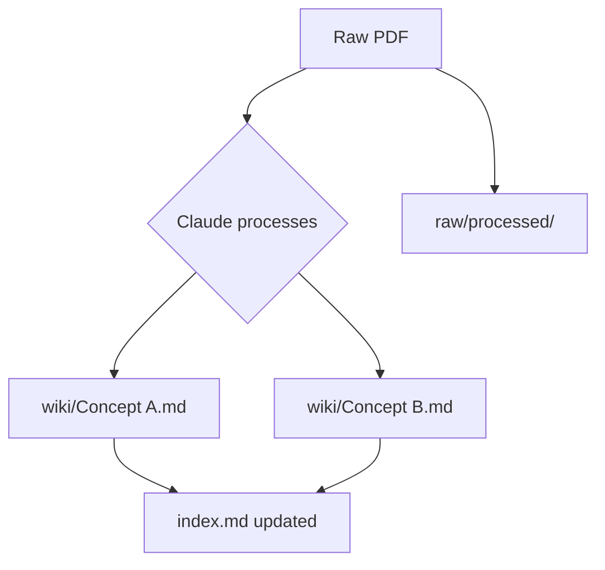
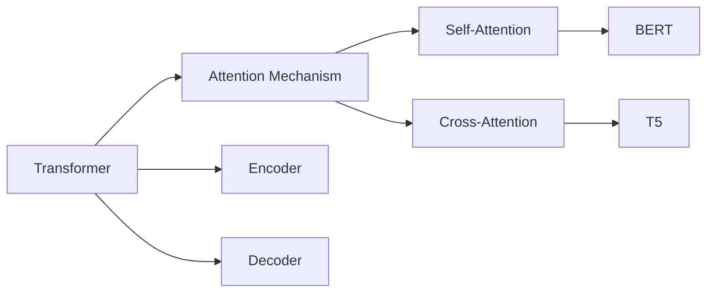
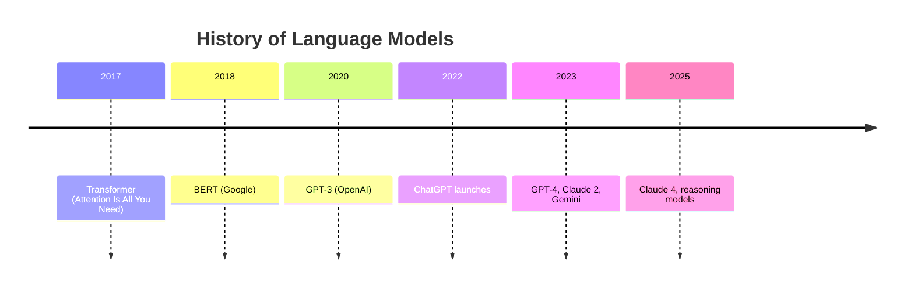
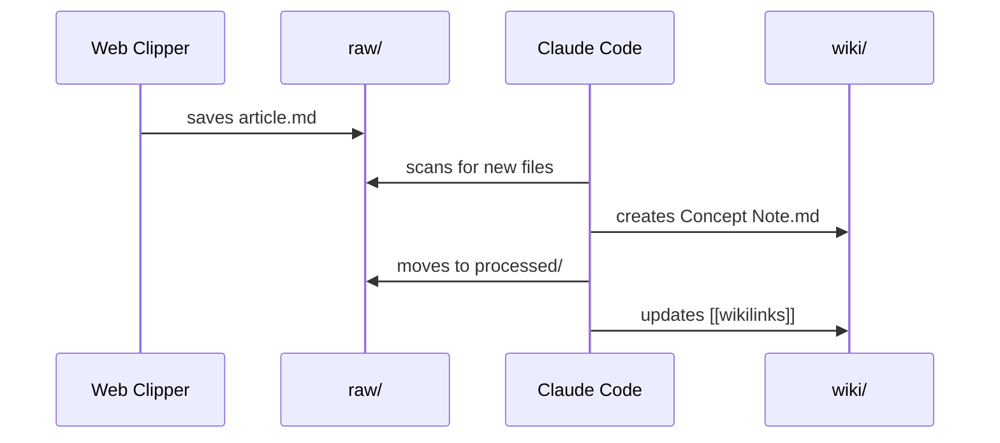
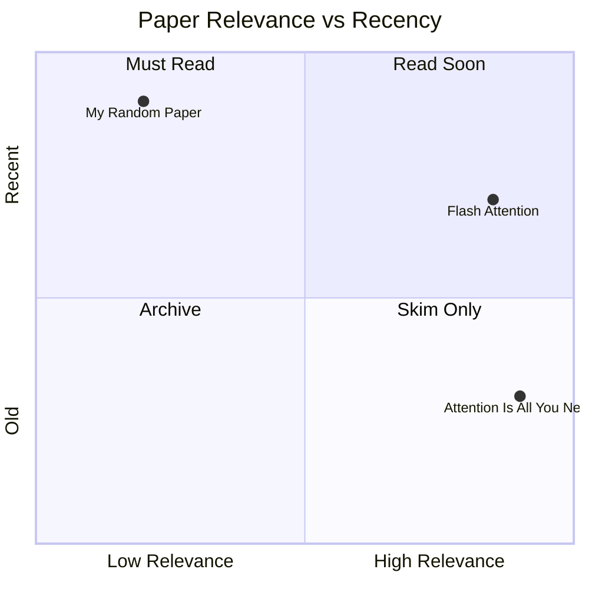

# Graphs & Visualization in Obsidian — Technical Guide

Three distinct tools, three distinct purposes. Use the right one for the job.

---

## Overview

| Tool | What it shows | Syntax | Needs plugin? |
|------|--------------|--------|---------------|
| **Graph View** | Link network across vault | Built-in UI | No |
| **Mermaid** | Diagrams inside a note | Code block | No |
| **Dataview / DataviewJS** | Queries + tables + lists | Code block | Dataview plugin |
| **Charts View** | Bar, line, pie, radar charts | Code block | Charts View plugin |

---

## 1. Graph View — The Link Network

Shows every note as a node, every `[[wikilink]]` as an edge.
**This is your vault's connective tissue visualized.**

### Open it
- Sidebar icon (looks like a network) → **Global Graph**
- Current note → **Local Graph** (Ctrl/Cmd + click the graph icon)

### Make it useful — filter by frontmatter

In the Graph View settings panel (top-right gear):

```
# Show only wiki notes
path:wiki/

# Show only evergreen notes
frontmatter:status:evergreen

# Show only a specific tag
tag:#ml

# Exclude attachments and templates
-path:_attachments/ -path:_templates/
```

### Color groups (set in Graph View → Groups)

```
tag:#ml          → blue
tag:#pkm         → green
type:paper       → orange
type:concept     → purple
path:journal/    → grey
```

### What to watch for

- **Orphan nodes** (no links) → notes that need to be connected
- **Hub nodes** (many links) → your core concepts — make sure they're evergreen
- **Clusters** → topic neighborhoods forming naturally

### Local graph (most useful day-to-day)

Open any wiki note → Ctrl+G → see only its neighborhood.
Set depth to 2 to see two hops of connections.

---

## 2. Mermaid — Diagrams Inside Notes

Native to Obsidian, no plugin needed. Use inside any note with a `mermaid` code block.

### Flowchart

````markdown

````

### Concept relationship map

````markdown

````

### Timeline

````markdown

````

### Sequence diagram (for processes / workflows)

````markdown

````

### Quadrant chart (for prioritization)

````markdown

````

---

## 3. Dataview — Query Your Vault Like a Database

**Install:** Settings → Community Plugins → Dataview

Queries read the frontmatter of every note and return results dynamically.

### Basic: list all papers

````markdown
```dataview
LIST
FROM "wiki"
WHERE type = "paper"
SORT date DESC
```
````

### Table: papers with status and tags

````markdown
```dataview
TABLE date, tags, status
FROM "wiki"
WHERE type = "paper"
SORT date DESC
```
````

### Table: seedling notes that need work

````markdown
```dataview
TABLE file.mtime as "Last Modified", tags
FROM "wiki"
WHERE status = "seedling"
SORT file.mtime ASC
```
````

### List: orphan notes (no outgoing links)

````markdown
```dataview
LIST
FROM "wiki"
WHERE length(file.outlinks) = 0
```
````

### List: everything tagged #ml from this month

````markdown
```dataview
LIST
FROM #ml
WHERE date >= date(today) - dur(30 days)
SORT date DESC
```
````

### Inline Dataview (inside sentences)

```markdown
I have `= length(dv.pages('"wiki"'))` wiki pages.
Last updated: `= date(today)`
```

---

## 4. DataviewJS + Charts View — Visual Data Graphs

**Install:** Charts View plugin + Dataview (both required)

This is how you get bar charts, line graphs, etc. from your vault data.

### Count notes by type (bar chart)

````markdown
```dataviewjs
const pages = dv.pages('"wiki"');
const types = {};
for (const p of pages) {
    const t = p.type || "unknown";
    types[t] = (types[t] || 0) + 1;
}
const labels = Object.keys(types);
const data = labels.map(l => types[l]);

dv.paragraph("**Notes by type**");
dv.paragraph(
    window.renderChart({
        type: "bar",
        data: {
            labels: labels,
            datasets: [{ label: "Count", data: data,
                backgroundColor: ["#4f86c6","#f4845f","#67b99a","#b39ddb","#f48fb1"] }]
        },
        options: { plugins: { legend: { display: false } } }
    }, this.container)
);
```
````

### Notes added per month (line chart)

````markdown
```dataviewjs
const pages = dv.pages('"wiki"').where(p => p.date);
const monthly = {};
for (const p of pages) {
    const key = p.date.toFormat("yyyy-MM");
    monthly[key] = (monthly[key] || 0) + 1;
}
const sorted = Object.keys(monthly).sort();
const data = sorted.map(k => monthly[k]);

window.renderChart({
    type: "line",
    data: {
        labels: sorted,
        datasets: [{ label: "Notes added", data: data,
            borderColor: "#4f86c6", fill: false, tension: 0.3 }]
    }
}, this.container);
```
````

### Status breakdown (doughnut chart)

````markdown
```dataviewjs
const pages = dv.pages('"wiki"');
const counts = { seedling: 0, growing: 0, evergreen: 0 };
for (const p of pages) {
    const s = p.status || "seedling";
    if (counts[s] !== undefined) counts[s]++;
}

window.renderChart({
    type: "doughnut",
    data: {
        labels: ["Seedling", "Growing", "Evergreen"],
        datasets: [{
            data: [counts.seedling, counts.growing, counts.evergreen],
            backgroundColor: ["#f4845f", "#ffd54f", "#67b99a"]
        }]
    }
}, this.container);
```
````

---

## 5. Ask Claude Code to Build Graphs For You

You don't need to write Dataview queries from scratch.

```bash
cd ~/second-brain && claude
```

Then ask:

```
"Create a Dataview table in wiki/Dashboard.md showing all papers,
sorted by date, with columns for title, tags, year, and status."

"Write a DataviewJS bar chart showing how many notes I've added
per month since January 2026. Put it in wiki/Dashboard.md."

"Create a Mermaid diagram in wiki/ML Landscape.md showing the
relationships between all notes tagged #ml and #architecture."

"Find all orphan notes (no wikilinks) and list them in index.md
under a section called '## Needs Connecting'."
```

---

## 6. Dashboard Note (put this at vault root)

Create `Dashboard.md` — your vault's home screen in Obsidian.

````markdown
# Second Brain Dashboard

## Recent additions
```dataview
TABLE date, type, status
FROM "wiki"
SORT date DESC
LIMIT 10
```

## Needs attention (seedlings)
```dataview
LIST
FROM "wiki"
WHERE status = "seedling"
SORT file.mtime ASC
LIMIT 10
```

## Unprocessed inbox
```dataview
LIST
FROM "raw"
WHERE file.folder = "raw"
SORT file.ctime ASC
```

## Orphan notes
```dataview
LIST
FROM "wiki"
WHERE length(file.outlinks) = 0
```
````

Pin this as your startup note: Settings → Appearance → set as default start page.

---

## Cheatsheet

```
Graph View          → Ctrl+G (local) or sidebar icon (global)
Filter by type      → path:wiki/ tag:#ml frontmatter:type:paper
Mermaid block       → ```mermaid ... ```
Dataview block      → ```dataview ... ```
DataviewJS block    → ```dataviewjs ... ```
Ask Claude to build → cd ~/second-brain && claude → describe what you want
```
